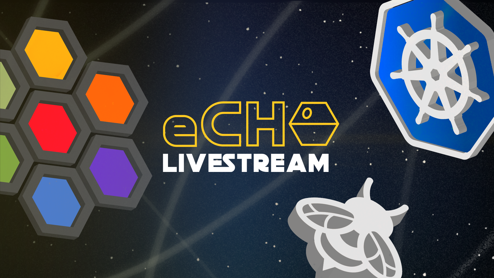

# eCHO - eBPF & Cilium Office Hours

With a little bit of imagination, eCHO stands for "eBPF & Cilium Office Hours". Inspired by [TGIK](https://github.com/vmware-tanzu/tgik) this is a livestream hosted by [Liz Rice](https://twitter.com/lizrice) and [Duffie Cooley](https://twitter.com/mauilion) where we'll discuss all things related to the Cilium project and the broader world of eBPF. We'd love your questions during the show!

Previous episodes are all [here on YouTube](https://www.youtube.com/playlist?list=PLDg_GiBbAx-mY3VFLPbLHcxo6wUjejAOC).

We also provide **[eCHO news](https://cilium.io/newsletter/)** as a bi-weekly community wrap up of all things happening in eBPF and Cilium. Sign up today!

## Upcoming episodes

[**View Episode Calendar**](https://calendar.google.com/calendar/embed?src=c_r0u072069ks1htjgkn8j4a9dj0%40group.calendar.google.com&ctz=Europe%2FLondon) | [**Add Google Calendar**](https://calendar.google.com/calendar/u/0?cid=Y19yMHUwNzIwNjlrczFodGpna244ajRhOWRqMEBncm91cC5jYWxlbmRhci5nb29nbGUuY29t) | [**Subscribe on YouTube**](https://youtube.com/playlist?list=PLDg_GiBbAx-mY3VFLPbLHcxo6wUjejAOC)

Episode #96: [Cluster API and Virtink pt. 2](https://www.youtube.com/watch?v=Sv7XfmT1E-Y)
  - 11am PT, 8pm CEST, 7pm UK, 5pm Central Europe - 23rd June 2023
  - [Convert to your timezone / get calendar link](https://www.timeanddate.com/worldclock/fixedtime.html?msg=eCHO+-+eBPF+%26+Cilium+Office+Hours&iso=20230623T11&p1=224&ah=1)

## Suggest a topic

Please [open an issue](https://github.com/isovalent/eCHO/issues/new) if you have an idea for a topic we should cover or a guest we should invite.

## Previous episodes
- Episode #95: [Cilium 1.14 Sneak Peak](https://youtu.be/ZDZkd3OSgds) with [Liz Rice](https://twitter.com/lizrice) and [Nico Vibert](https://twitter.com/nicovibert)
  - [Show notes](episodes/095)
- Episode #94: [New Cluster API provider virtink](https://youtu.be/HVqQhMRpUR4) with [Duffie Cooley](https://twitter.com/mauilion)
  - [Show notes](episodes/094)
- Episode #93: [BPF Signing](https://youtu.be/8mTWsFUAURE) with [Jef Spaleta](https://twitter.com/jspaleta) and [Lorenz Bauer](https://www.linkedin.com/in/lorenzbauer/)
  - [Show notes](episodes/093)
- Episode #92: [Cilium External Workloads](https://youtu.be/bbmtsBsZpSo) with [Jef Spaleta](https://twitter.com/jspaleta)
  - [Show notes](episodes/092)
- Episode #91: [Announcing services at L2](https://youtu.be/DdWksYq5Pv4) with [Liz Rice](https://twitter.com/lizrice) and [Dylan Reimerink](https://www.linkedin.com/in/dylan-reimerink-64ba1610a)
  - [Show notes](episodes/091)
- Episode #90: [Cassandra and cilium clustermesh](https://youtu.be/IdKa4_TFy00) with [Duffie Cooley](https://twitter.com/mauilion)
  - [Show notes](episodes/090)
- Episode #89: [Stack walking](https://youtu.be/Dxno5UpLbZ0) with [Liz Rice](https://twitter.com/lizrice) and [Javier Honduvilla](https://twitter.com/javierhonduco)
  - [Show notes](episodes/089)
- Episode #88: [Kubecon and Cilium Con Wrap-up](https://youtu.be/jgM2ZAxl1G8) with [Duffie Cooley](https://twitter.com/mauilion)
  - [Show notes](episodes/088)
- Episode #87: [Advanced Gateway API Use Cases](https://youtu.be/YVO-jateXA0) with [Jef Spaleta](https://twitter.com/jspaleta) and [Nico Vibert](https://twitter.com/nicovibert)
  - [Show notes](episodes/087)
- Episode #86: [Cilium En Français!](https://youtu.be/WtGYlsAMq4A) with [Nico Vibert](https://twitter.com/nicovibert) and [Raphaël Pinson](https://twitter.com/raphink)
  - [Show notes](episodes/086)
- Episode #85: [Migrating to Cilium](https://youtu.be/-ypU-W-Sdhk) with [Duffie Cooley](https://twitter.com/mauilion)
  - [Show notes](episodes/085)
- Episode #84: [Discussion with Deutsche Telekom](https://youtu.be/9Mm_7ny4qLg) with [Dan Finneran](https://twitter.com/thebsdbox), [Christopher Dziomba](https://twitter.com/chd__) and [Vuk Gojnic](https://twitter.com/vukgojnic)
  - [Show notes](episodes/084)
- Episode #82: [Cilium 1.13 Release!🎉](https://youtu.be/QxaFixU-EPY) with [Dan Finneran](https://twitter.com/thebsdbox) and [Nico Vibert](https://twitter.com/nicovibert)
  - [Show notes](episodes/082)
- Episode #81: [Open Source XDP for Windows](https://youtu.be/r7wD2hvOv-k) with [Tracy P Holmes](https://twitter.com/tracypholmes) and [Nick Banks](https://twitter.com/gamernb)
  - [Show notes](episodes/081)
- Episode #80: [Kepler](https://youtu.be/xzfTU_Wa7rU) with [Liz Rice](https://twitter.com/lizrice) and [Huamin Chen](https://twitter.com/root_fs)
  - [Show notes](episodes/080)
- Episode #79: [Wireguard Lab!](https://youtu.be/vj7M-t9MK6s) with [Duffie Cooley](https://twitter.com/mauilion)
  - [Show notes](episodes/079)
- Episode #78: [SCTP](https://youtu.be/2lD86qNHXXI) with [Dan Finneran](https://twitter.com/thebsdbox)
  - [Show notes](episodes/078)
- Episode #77: [Automating Clusters and Cilium with Flux Part 3](https://youtu.be/VTKVGSw5MD4) with [Duffie Cooley](https://twitter.com/mauilion)
  - [Show notes](episodes/077)
- Episode #76: [Cilium Egress Gateway](https://youtu.be/zEQdgNGa7bg) with [Liz Rice](https://twitter.com/lizrice) and [Dan Finneran](https://twitter.com/thebsdbox)
  - [Show notes](episodes/076)
- Episode #75: [Automating Clusters and Cilium with Flux Part 2](https://youtu.be/4RqwWw9-GIk) with [Duffie Cooley](https://twitter.com/mauilion)
  - [Show notes](episodes/075)
- Episode #74: [eBPF Tail Calls](https://youtu.be/3qLXw3E0YWg) with [Liz Rice](https://twitter.com/lizrice) and [Dan Finneran](https://twitter.com/thebsdbox)
  - [Show notes](episodes/074)
- Episode #73: [Automating Clusters and Cilium with Flux](https://youtu.be/al049I2j1jk) with [Duffie Cooley](https://twitter.com/mauilion)
  - [Show notes](episodes/073)
- Episode #72: [Cilium Ingress with kube-vip and the new BGP and LB-IPAM features in Cilium](https://youtu.be/t5nP_JT8qUg) with [Dan Finneran](https://twitter.com/thebsdbox) and Dylan Reimerink
  - [Show notes](episodes/072)
- Episode #71: [Cilium CLI Helm Integration!](https://youtu.be/vDCNNz5VQnE) with [Duffie Cooley](https://twitter.com/mauilion)
  - [Show notes](episodes/071)
- Episode #70: [Azure CNI powered by Cilium](https://youtu.be/8it8Hm2F_GM) with [Liz Rice](https://twitter.com/lizrice) and [Nico Vibert](https://twitter.com/nicovibert)
- [Show notes](episodes/070)
- Episode #69: [Cluster API and Cilium - Evaluating Cluster API Distros](https://www.youtube.com/watch?v=oTCRZ-bt-Xo) with [Duffie Cooley](https://twitter.com/mauilion) and [Nicholas Lane](https://twitter.com/apinick)
  - [Show notes](episodes/069)
- Episode #68: [Cilium and Grafana!](https://youtu.be/HNxJyabrQfg) with [Liz Rice](https://twitter.com/lizrice) and [Anna Kapuścińska](https://twitter.com/lambdanis)
  - [Show notes](episodes/068)
- Episode #67: [Kubecon NA 2022 Recap!](https://www.youtube.com/watch?v=pitQjFnVKxc) with [Liz Rice](https://twitter.com/lizrice) and [Bill Mulligan](https://twitter.com/breakawaybilly)
  - [Show notes](episodes/067)
- Episode #66: [Cilium at Kubecon NA 2022](https://www.youtube.com/watch?v=WPfh_zEwVek) with [Duffie Cooley](https://twitter.com/mauilion)
  - [Show notes](episodes/066)
- Episode #65: [bpfd](https://www.youtube.com/watch?v=KskHG7jU1Q0) with [Liz Rice](https://twitter.com/lizrice) and [Dave Tucker](https://twitter.com/dave_tucker)
  - [Show notes](episodes/065)
- Episode #64: [eBPF Summit CTF #3](https://www.youtube.com/watch?v=CBUIy0FzxFY) with [Liz Rice](https://twitter.com/lizrice) and [Duffie Cooley](https://twitter.com/mauilion)
  - [Show notes](episodes/064)
- Episode #63: [Cilium BPF Recorder](https://www.youtube.com/watch?v=zh1y155aeJM) with [Duffie Cooley](https://twitter.com/mauilion)
  - [Show notes](episodes/063)
- Episode #62: [Linux Plumbers Conference BPF Track Recap](https://www.youtube.com/watch?v=gBVeoDy2xkA) with [Liz Rice](https://twitter.com/lizrice) and [Daniel Borkmann](https://github.com/borkmann)
  - [Show notes](episodes/062)
- Episode #61: [Cilium - Tanzu Community Edition](https://youtu.be/ywa1wEQTajs) with [Duffie Cooley](https://twitter.com/mauilion) and [DaShaun Carter](https://twitter.com/dashaun)
  - [Show notes](episodes/061)
- Episode #60: [Clilium - Community Edition](https://youtu.be/vJLW8V72vMk) with [Tracy P Holmes](https://twitter.com/tracypholmes), [Bill Mulligan](https://twitter.com/breakawaybilly), and [Joe Stringer](https://twitter.com/joestringernz)
  - [Show notes](episodes/060)
- Episode #59: [Dual Stack with Cilium](https://youtu.be/SwXvGeMy3Wg) with [Duffie Cooley](https://twitter.com/mauilion)
  - [Show notes](episodes/059)
- Episode #58: [Cilium Service Mesh and Ingress](https://youtu.be/oeh3u4V2--M) with [Liz Rice](https://twitter.com/lizrice) and [Nick Young](https://twitter.com/youngnick)
  - [Show notes](episodes/058)
- Episode #57: [Life of a Packet: Services Continued](https://youtu.be/Pju0MQRblmc) with [Duffie Cooley](https://twitter.com/mauilion)
  - [Show notes](episodes/057)
- Episode #56: [Anatomy of an eBPF program](https://youtu.be/nXL737H8Kcc) with [Liz Rice](https://twitter.com/lizrice)
  - [Show notes](episodes/056)
- Episode #55: [Cilium 1.12 Release](https://youtu.be/oeh3u4V2--M) with [Duffie Cooley](https://twitter.com/mauilion), [Quentin
  Monnet](https://twitter.com/qeole), [Bruno M.Custódio](https://twitter.com/bmcustodio) and many other guests!
  - [Show notes](episodes/055)
- Episode #54: [Tetragon](https://youtu.be/vVFg8WkaeeM) with [Tracy P Holmes](https://twitter.com/tracypholmes) and [Natália Réka Ivánkó](https://twitter.com/nataliaivanko)
  - [Show notes](episodes/054)
- Episode #53: [Life of a Packet: Services](https://youtu.be/SGfMEpjq07Q) with [Duffie Cooley](https://twitter.com/mauilion)
  - [Show notes](episodes/053)
- Episode #52: [Cilium Interactive Labs](https://youtu.be/HiT2wxQdNBM) with [Liz Rice](https://twitter.com/lizrice), [Nico Vibert](https://twitter.com/nicovibert) and [Raphaël Pinson](https://twitter.com/raphink)
  - [Show notes](episodes/052)
- Episode #51: [Life of a Packet: Pod to Pod](https://youtu.be/0BKU6avwS98) with [Duffie Cooley](https://twitter.com/mauilion)
  - [Show notes](episodes/051)
- Episode #50: [BTFGEN](https://youtu.be/zdbCvGSdFiQ) with [Liz Rice](https://twitter.com/lizrice) and [Mauricio Vásquez Bernal](https://twitter.com/maurovasquezb)
  - [Show notes](episodes/050)
- Episode #49: [Graceful Termination](https://youtu.be/9GBxJMp6UkI) with [Duffie Cooley](https://twitter.com/mauilion)
  - [Show notes](episodes/049)
- Episode #48: [Pixie](https://youtu.be/j090RUVuKKk) with [Zain Asgar](https://twitter.com/zainasgar) and [Omid Azizi](https://twitter.com/oazizi)
  - [Show notes](/episodes/048)
- Episode #47: [KubeCon EU wrap-up](https://youtu.be/fTTBk4YFeyc) with [Nicholas Lane](https://twitter.com/apinick) and [Bill Mulligan](https://twitter.com/breakawaybilly)
  - [Show notes](/episodes/047)
- Episode #46: [Security Observability and Runtime Enforcement with Cilium Tetragon](https://youtu.be/1rpykZ8FUvs) with [Liz Rice](https://twitter.com/lizrice) and [Thomas Graf](https://twitter.com/tgraf__)
  - [Show notes](/episodes/046)
- Episode #45: [KubeCon EU Preview](https://youtu.be/0-mD02qYXHg) with [Duffie
  Cooley](https://twitter.com/mauilion) and [Nicholas Lane](https://twitter.com/apinick)
  - [Show notes](/episodes/045)
- Episode #44: [The Inside Track on Sidecarless Service Mesh](https://youtu.be/XpccICEYqiA) with [Thomas Graf](https://twitter.com/tgraf__)
  - [Show notes](/episodes/044)
- Episode #43: [Deepdive FQDN Policy](https://youtu.be/iJ98HRZi8hM) with [Duffie
  Cooley](https://twitter.com/mauilion)
  - [Show notes](/episodes/043)
- Episode #42: [Multus and Cilium](https://youtu.be/bIYZrSoGTFg) with [Duffie
  Cooley](https://twitter.com/mauilion)
  - [Show notes](/episodes/042)
- Episode #41: [Cilium Cluster Mesh](https://youtu.be/VBOONHW65NU) with [Liz
  Rice](https://twitter.com/lizrice)
  - [Show notes](/episodes/041)
- Episode #40: [Host firewall](https://youtu.be/GLLLcz398K0) with [Liz Rice](https://twitter.com/lizrice)
  - [Show notes and config examples](/episodes/040)
- Episode #39: [Local redirect policy](https://youtu.be/BT_gdlhjiQc) with Duffie Cooley
- Episode #38: [bpfcov](https://youtu.be/wul6NBU23zY) with [Leo Di Donato](https://twitter.com/leodido)
  - [Show notes](/episodes/038)
- Episode #37: [Rancher RKE2 and topology aware routing](https://youtu.be/P7WKlhyoyMA)
- Episode #36: [Sysmon for Linux](https://youtu.be/HsvYBnGq3FA) with [Kevin Sheldrake](https://twitter.com/kevsecurity)
  - [Show notes](/episodes/036)
- Episode #35: [Kubernetes Topology aware routing and Cilium](https://youtu.be/7Clr3rY02NQ)
- Episode #34: [Parca](https://youtu.be/HGyNZaJuqIM) with [Frederic Branczyk](https://twitter.com/fredbrancz)
  - [Show notes](/episodes/034)
- Episode #33: [Bumblebee](https://youtu.be/AYLpK5zHzCo)
  - [Show notes](/episodes/033)
- Episode #32: [Hands on with Cilium Service Mesh](https://youtu.be/s-tgbD7wN3U)
  - [Show notes](/episodes/032)
- Episode #31: [Openshift and cilium!](https://youtu.be/4jwIBS5IzYg) exploring
  netboot pxe haproxy openshift and cilium!
- Episode #30: [1.11 release](https://youtu.be/nsfbFUO8eu4) with Louis de los Santos and Christopher Luciano
  - [Show notes](/episodes/030)
- Episode #29: [BPF LSM](https://youtu.be/OBFYMBHrstI) with [KP Singh](https://twitter.com/_kpsingh)
  - [Show notes](/episodes/029)
- Episode #28: [Packet Where R U?](https://youtu.be/JEY3s0JAB1s) with [Martynas Pumputis](https://twitter.com/martyns)
- Episode #27: [eBPF Service Mesh](https://youtu.be/nJT0ASbGLvs) with [Thomas Graf](https://twitter.com/tgraf__)
  - [Show notes](/episodes/027)
- Episode #26: [Post KubeCon wrap-up](https://www.youtube.com/watch?v=Qw_epZdkHFw)
- Episode #25: [Aya, Rust & eBPF](https://youtu.be/TQ0ou-eFLAk) with [Dave Tucker](https://twitter.com/dave-tucker) & [Alessandro Decina](https://twitter.com/alessandrod)
  - [Show notes](/episodes/025)
- Episode #24: [kubecon and ebpf day preview!](https://youtu.be/do6yKVlICIc)
  - [Show notes](/episodes/024)
- Episode #23: [cilium/ebpf](https://youtu.be/8z2R13GRi5g) with [Timo Beckers](https://github.com/ti-mo)
  - [Show notes](/episodes/023)
- Episode #22: [EKS Anywhere](https://youtu.be/yAoZi89CZ5o) with [Justin Garrison](https://twitter.com/rothgar)
- Episode #21 had to be cancelled with late notice (sorry!)
- Episode #20: [conntracker](https://youtu.be/NuXo8waYKzA) with [Rafael David Tinco](https://twitter.com/rafaeldtinoco)
  - [Show notes](/epsisodes/020)
- Episode #19: [Inspektor Gadget](https://youtu.be/RZ2qNm_vlUc) with [Marga Manterola](https://twitter.com/marga_manterola)
  - [Show notes](/episodes/019)
- Episode #18: [eBPF Capture The Flag part #3](https://youtu.be/l18YnO2b7mM)
  with [Tabitha Sable](https://twitter.com/tabbysable), [Liz
  Rice](https://twitter.com/lizrice) and a team of solvers from
  [Isovalent](https://isovalent.com)
  - [Show notes](/episodes/018)
- Episode #17: [CVE 2021 3490](https://youtu.be/VZ1V2nMvQH4) with [Duffie
  Cooley](https://twitter.com/mauilion)
- Episode #16: [kubectl-trace continued](https://youtu.be/cXyYT0Zhors) with
  [Duffie Cooley](https://twitter.com/mauilion)
- Episode #15: [Tracee](https://youtu.be/aOgidMoPz9A) with [Itay Shakury](https://twitter.com/itaysk)
  - [Show notes](/episodes/015)
- Episode #14: [netkat](https://youtu.be/yabzjJMdI08) with [Antonio Ojea](https://twitter.com/itsuugo)
  - [Show notes](/episodes/014)
- Episode #13: [XDP Tutorial](https://youtu.be/YUI78vC4qSQ) with [Liz Rice](https://twitter.com/lizrice)
  - [Show notes](/episodes/013)
- Episode #12: [kubectl trace](https://youtu.be/J-fyQ3H4hLw)
  - [Show notes](/episodes/012)
- Episode #11: [Exploring bpftool](https://youtu.be/1EOLh3zzWP4) with [Quentin Monnet](https://twitter.com/qeole)
  - [Show notes](/episodes/011)
- Episode #10: [eBPF for Windows](https://youtu.be/LrrV-eo6fug) with [Dave Thaler](https://github.com/dthaler)
  - [Show notes](/episodes/010)
- Episode #9: [XDP and load balancing](https://youtu.be/OIyPm6K4ooY) with [Daniel Borkmann](https://github.com/borkmann)
  - [Show notes](/episodes/009)
- Episode #8: [Cilium CLI](https://youtu.be/ndjmaM1i0WQ) with [Duffie Cooley](https://twitter.com/mauilion)
  - [Show notes](/episodes/008)
- Episode #7: [DNS](https://youtu.be/mo0RIJZypbQ) with [Laurent Bernaille](https://twitter.com/lbernail)
  - [Show notes](/episodes/007)
- Episode #6: [Cilium 1.10](https://youtu.be/y5xcvr_fgxc) with [Joe Stringer](https://twitter.com/joestringernz)
  - [Show notes](/episodes/006)
- Episode #5: [Network performance](https://youtu.be/2lGag_j4dIw) with [Thomas Graf](https://twitter.com/tgraf__)
  - [Show notes](/episodes/005)
- Episode #4: [KubeCon & COSI](https://youtu.be/d2I2kLd7AwU) with [Kris Nóva](https://twitter.com/krisnova)
  - [Show notes](/episodes/004)
- Episode #3: [Wireguard](https://youtu.be/-awkPi3D60E) with [Martynas Pumputis](https://twitter.com/martyns)
  - [Show notes](/episodes/003)
- Episode #2: [Intro to Hubble](https://youtu.be/hD2iJUyIXQw) with [Glib Smaga](https://twitter.com/glibsm)
  - [Show notes](/episodes/002)
- Episode #1: [Intro to Cilium](https://youtu.be/80OYrzS1dCA) with [Thomas Graf](https://twitter.com/tgraf__)
  - [Show notes](/episodes/001)
