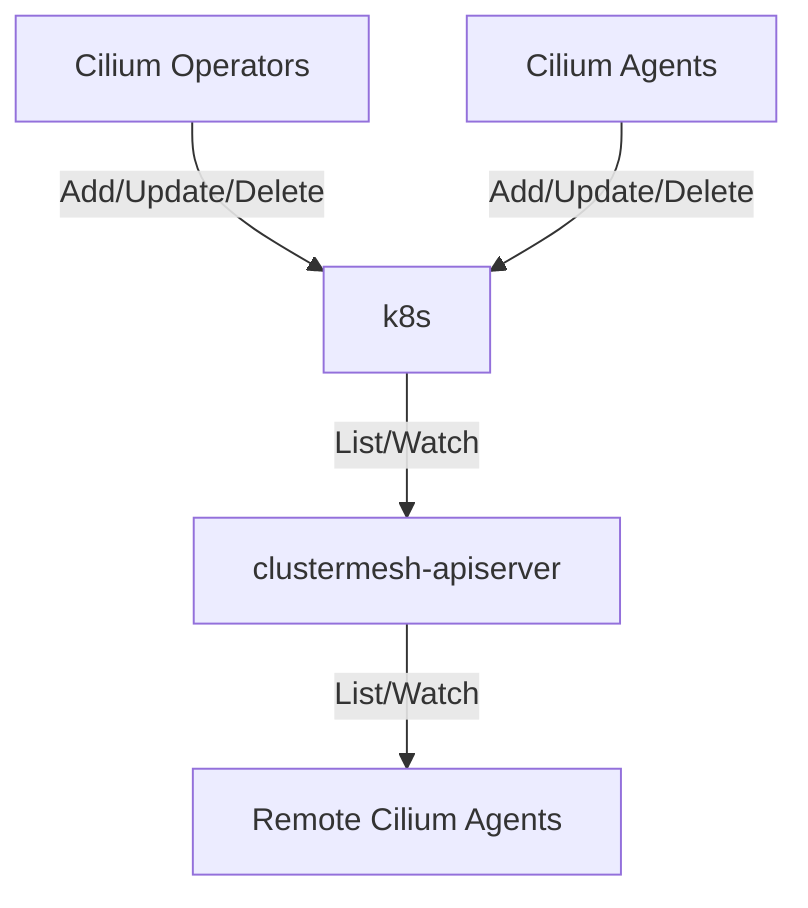
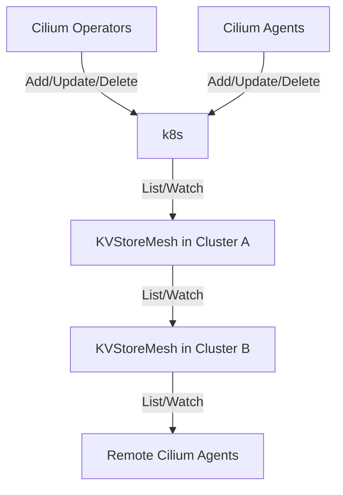

# Episode 122: cilium 1.15 US

with Duffie Cooley, Joe Stringer, Ryan Drew

## KVStoreMesh

### What is KVStoreMesh?

Alternative implementation for ClusterMesh. Built to address scaling issues that Cilium's current ClusterMesh implementation faces, referred to as clustermesh-apiserver.

clustermesh-apiserver architecture:

clustermesh-apiserver has etcd instance which watches Kubernetes apiserver for udpates on target resources. Target resources are stored in clustermesh-apiserver's Etcd and propagated to remote Cilium Agents.

KVStoreMesh architecture:

KVStoreMesh apiserver has etcd instance which also watches and replicates target resources from in-cluster Kubernetes apiserver. KVStoreMesh apiservers watch each other for updates to target resources and propagate these updates to in-cluster Cilium Agents.

This change reduces overall failure domain and helps to spread load more evenly throughout the mesh.

### Scale Testing

#### clustermesh-apiserver

Created a test environment with 256 clusters and tried to scale to 50k nodes. Toppled over at around 45k.

Discovered issues:

1. clustermesh-apiserver's Etcd was unable to keep up with load and began dropping watches from Cilium Agents. Gathered metrics showed max CPU usage at just under 50 cores during the drop.
2. Issue with Etcd leases: https://github.com/etcd-io/etcd/issues/15993. Time of Put request to key with attached lease increases linearly with the number of keys already attached to the lease.

#### KVStoreMesh

Created a test environment with 256 clusters and tried to scale to 50k nodes.

KVStoreMesh's etcd has CPU usage under 1 core and memory usage under 512 MiB throughout duration of the test.

### More Information

* [Why KVStoreMesh? Lessons Learned from Scale Testing Cluster Mesh with 50k Nodes Across 255 Clusters - Ryan Drew](https://youtu.be/biZMCj1rLoM?si=oo8_oURtpDMLHpRq)
* [Scaling Kubernetes Networking to 1k, 5k, ... 100k Nodes!? - Marcel Zięba, Isovalent & Dorde Lapcevic, Google](https://youtu.be/VWGB-NW800Y)
* #sig-scalability in [Cilium Community Slack](https://cilium.herokuapp.com/)
